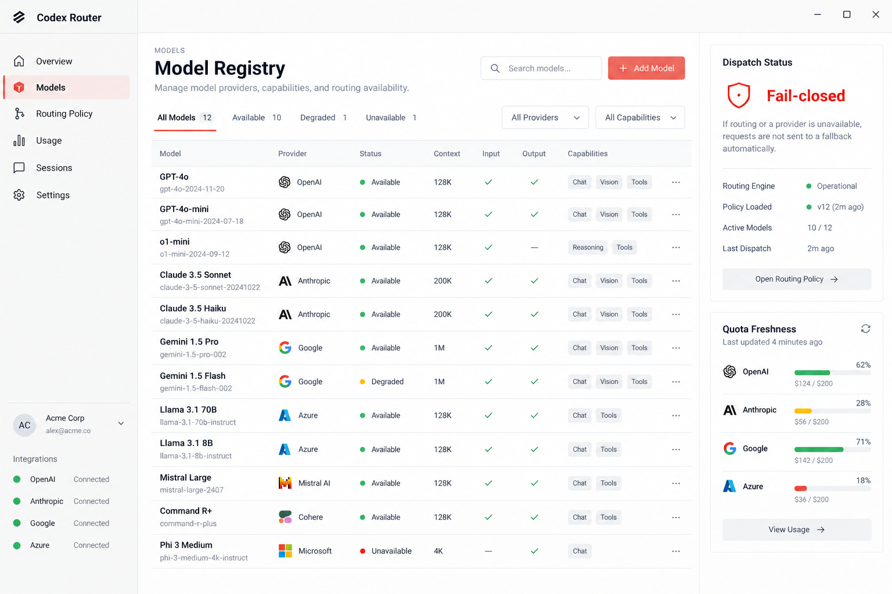
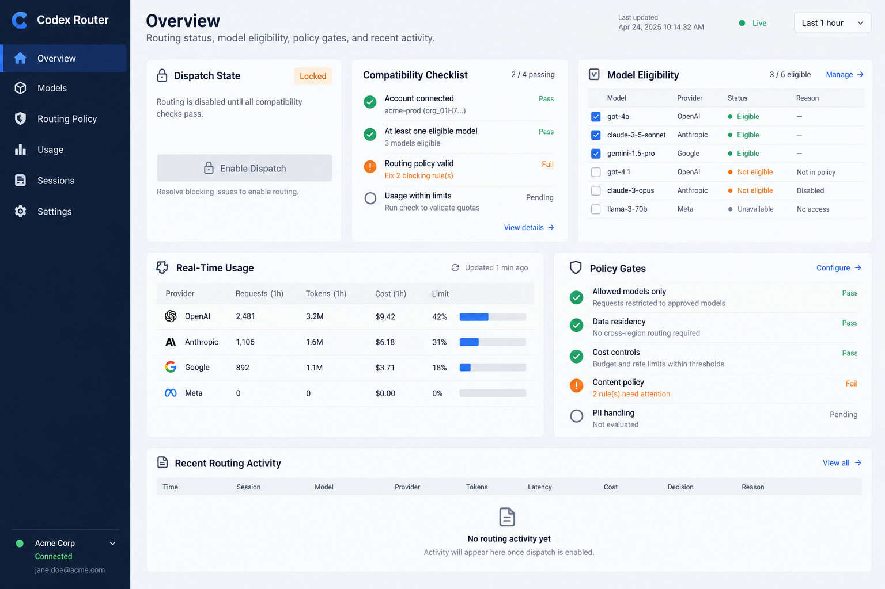

# Codex Router UI concepts

These generated concepts are visual references only. Their example model names, providers, quota amounts, and connection states are illustrative and are not product data.

## Concept A — Model registry

Light, table-first model management with a clear fail-closed dispatch state and a compact quota rail.

## Concept B — Routing overview

Light operations overview with a compatibility checklist, model eligibility table, real-time usage, and policy gates.

## Dribbble references

- [Orbit — ML model monitoring dashboard, dark UI](https://dribbble.com/shots/27229207-Orbit-ML-model-monitoring-dashboard-Dark-UI)
- [Dev AI App Design](https://dribbble.com/shots/26373500-Dev-AI-App-Design)

The Dribbble work is linked as external inspiration; it is not copied into this repository. The attached user screenshot is another reference for restrained settings navigation, whitespace, and compact tables.

## Implementation preference to confirm

Tailwind CSS is suitable for the implementation. Wait for the user to choose a concept or request a blend before changing the current control-panel code.
